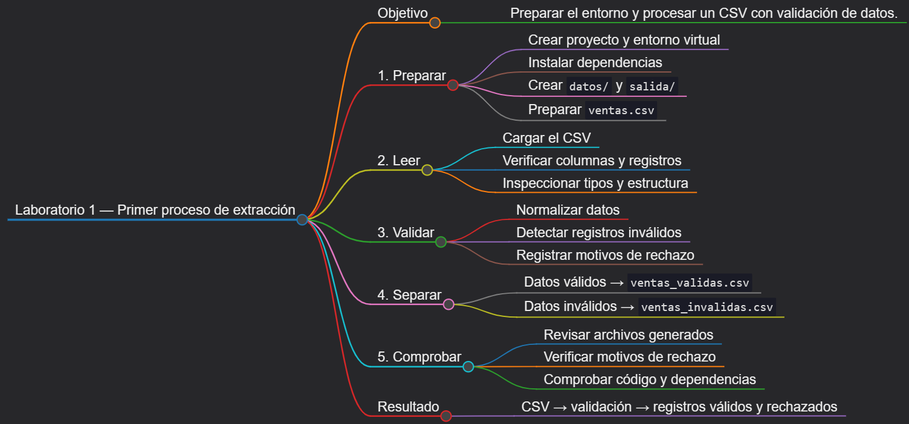
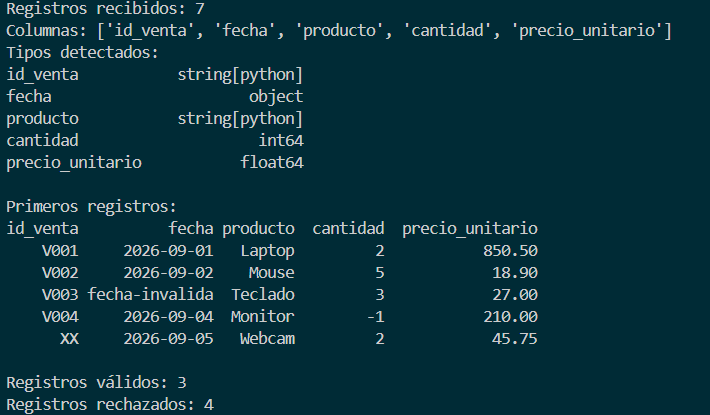

# Laboratorio 1: Preparación del entorno y primer proceso de extracción

## Objetivo de la práctica:

Crear un proyecto Python reproducible en Windows con un entorno virtual, instalar las bibliotecas esenciales del curso, leer un archivo CSV, inspeccionar su estructura, validar sus registros y generar archivos separados con los datos válidos y rechazados.

## Objetivo Visual:



## Duración aproximada:

- 30 minutos

## Instrucciones

### Tarea 1. **Preparación del entorno y proyecto**

Paso 1. En Windows, abra **Visual Studio Code**, cree una carpeta llamada `laboratorio_1` dentro de la carpeta del capítulo y ábrala con **File -> Open Folder**.

Paso 2. Verifique que cuenta con Python 3.11 o posterior.

```powershell
py -3 --version
```

Paso 3. Abra una terminal de PowerShell en VS Code y prepare el proyecto:

```powershell
py -3 -m venv .venv
.\.venv\Scripts\Activate.ps1
python -m pip install --upgrade pip
New-Item -ItemType Directory -Force -Path datos, salida
New-Item -ItemType File -Force -Path proceso_csv.py, requirements.txt
```

Si PowerShell impide activar el entorno, habilítelo solo para la terminal actual y repita la activación:

```powershell
Set-ExecutionPolicy -Scope Process -ExecutionPolicy Bypass
.\.venv\Scripts\Activate.ps1
```

Paso 4. Seleccione el intérprete `.venv\Scripts\python.exe` mediante **Python: Select Interpreter** en la paleta de comandos de VS Code.

Paso 5. Agregue las bibliotecas del capítulo al archivo `requirements.txt`:

```text
pandas>=2.2,<3
requests>=2.31,<3
SQLAlchemy>=2.0,<3
```

Paso 6. Instale las dependencias y compruebe que no existan conflictos:

```powershell
python -m pip install -r requirements.txt
python -m pip check
```

### Tarea 2. **Preparación del archivo de entrada**

Paso 7. Crear un documento dentro de `datos` llamado `ventas.csv`.

Paso 8. En `datos/ventas.csv` desde VS Code, coloque el siguiente contenido:

```csv
id_venta,fecha,producto,cantidad,precio_unitario
V001,2026-09-01,Laptop,2,850.50
V002,2026-09-02,Mouse,5,18.90
V003,fecha-invalida,Teclado,3,27.00
V004,2026-09-04,Monitor,-1,210.00
XX,2026-09-05,Webcam,2,45.75
V006,2026-09-06,,4,12.50
V007,2026-09-07,Base para laptop,3,32.00
```

### Tarea 3. **Lectura e inspección del CSV**

Paso 9. Abra `proceso_csv.py` y agregue las importaciones, rutas y columnas esperadas:

```python
from pathlib import Path

import pandas as pd


BASE_DIR = Path(__file__).resolve().parent
RUTA_ENTRADA = BASE_DIR / "datos" / "ventas.csv"
DIRECTORIO_SALIDA = BASE_DIR / "salida"
COLUMNAS_REQUERIDAS = {
    "id_venta",
    "fecha",
    "producto",
    "cantidad",
    "precio_unitario",
}
```

Paso 10. Agregue una función que lea el documento y compruebe su estructura antes de procesarlo:

```python
def cargar_ventas(ruta: Path) -> pd.DataFrame:
    if not ruta.exists():
        raise FileNotFoundError(f"No se encontró el archivo: {ruta}")

    df = pd.read_csv(
        ruta,
        encoding="utf-8",
        dtype={"id_venta": "string", "producto": "string"},
    )
    faltantes = COLUMNAS_REQUERIDAS - set(df.columns)
    if faltantes:
        raise ValueError(f"Faltan columnas obligatorias: {sorted(faltantes)}")
    if df.empty:
        raise ValueError("El archivo de entrada no contiene registros.")
    return df
```

Paso 11. Agregue una función de inspección para mostrar la cantidad de registros, las columnas y los tipos detectados:

```python
def mostrar_resumen(df: pd.DataFrame) -> None:
    print(f"Registros recibidos: {len(df)}")
    print(f"Columnas: {list(df.columns)}")
    print("Tipos detectados:")
    print(df.dtypes.to_string())
    print("\nPrimeros registros:")
    print(df.head().to_string(index=False))
```

### Tarea 4. **Normalización y validación de registros**

Paso 12. Agregue la función de validación. El identificador debe comenzar con `V` y tener al menos tres dígitos; la fecha debe ser válida; el producto no puede estar vacío; y la cantidad y el precio deben ser mayores que cero.

```python
def separar_registros(
    df: pd.DataFrame,
) -> tuple[pd.DataFrame, pd.DataFrame]:
    trabajo = df.copy()
    trabajo["id_venta"] = trabajo["id_venta"].str.strip().str.upper()
    trabajo["producto"] = trabajo["producto"].str.strip()
    trabajo["fecha"] = pd.to_datetime(trabajo["fecha"], errors="coerce")
    trabajo["cantidad"] = pd.to_numeric(trabajo["cantidad"], errors="coerce")
    trabajo["precio_unitario"] = pd.to_numeric(
        trabajo["precio_unitario"], errors="coerce"
    )

    motivos = pd.Series("", index=trabajo.index, dtype="string")
    reglas = [
        (~trabajo["id_venta"].str.fullmatch(r"V\d{3,}", na=False), "id inválido; "),
        (trabajo["fecha"].isna(), "fecha inválida; "),
        (trabajo["producto"].isna() | trabajo["producto"].eq(""), "producto vacío; "),
        (trabajo["cantidad"].isna() | trabajo["cantidad"].le(0), "cantidad inválida; "),
        (
            trabajo["precio_unitario"].isna()
            | trabajo["precio_unitario"].le(0),
            "precio inválido; ",
        ),
    ]
    for condicion, texto in reglas:
        motivos = motivos.mask(condicion, motivos + texto)

    trabajo["motivo_rechazo"] = motivos.str.rstrip("; ")
    validos = trabajo[trabajo["motivo_rechazo"].eq("")].drop(
        columns="motivo_rechazo"
    )
    invalidos = trabajo[trabajo["motivo_rechazo"].ne("")]
    return validos, invalidos
```

Paso 13. Agregue la función que genera los archivos de salida. Se usa `utf-8-sig` para que los caracteres especiales se abran correctamente en Excel para Windows.

```python
def guardar_resultados(
    validos: pd.DataFrame,
    invalidos: pd.DataFrame,
) -> None:
    DIRECTORIO_SALIDA.mkdir(parents=True, exist_ok=True)
    validos.to_csv(
        DIRECTORIO_SALIDA / "ventas_validas.csv",
        index=False,
        encoding="utf-8-sig",
        date_format="%Y-%m-%d",
    )
    invalidos.to_csv(
        DIRECTORIO_SALIDA / "ventas_invalidas.csv",
        index=False,
        encoding="utf-8-sig",
        date_format="%Y-%m-%d",
    )
```

### Tarea 5. **Orquestación y ejecución**

Paso 14. Agregue la función principal y el punto de entrada:

```python
def main() -> int:
    try:
        ventas = cargar_ventas(RUTA_ENTRADA)
        mostrar_resumen(ventas)
        validos, invalidos = separar_registros(ventas)
        guardar_resultados(validos, invalidos)
    except (OSError, ValueError, pd.errors.ParserError) as error:
        print(f"ERROR: {error}")
        return 1

    print(f"\nRegistros válidos: {len(validos)}")
    print(f"Registros rechazados: {len(invalidos)}")
    print(f"Resultados disponibles en: {DIRECTORIO_SALIDA}")
    return 0


if __name__ == "__main__":
    raise SystemExit(main())
```

Paso 15. Ejecute el proceso desde la terminal integrada:

```powershell
python proceso_csv.py
```

### Tarea 6. **Validaciones finales**

Paso 16. Abra `salida/ventas_validas.csv` y confirme que contiene `V001`, `V002` y `V007`.

Paso 17. Abra `salida/ventas_invalidas.csv` y compruebe que cada fila rechazada contiene un motivo claro.

Paso 18. Compruebe la sintaxis y las dependencias instaladas:

```powershell
python -m py_compile proceso_csv.py
python -m pip chec
```

### Resultado esperado


