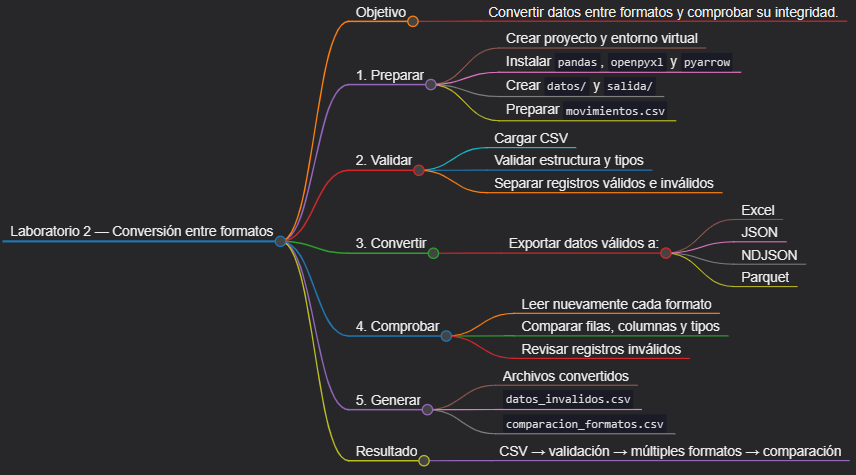
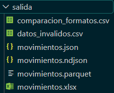

# Laboratorio 2: Conversión entre formatos de datos

## Objetivo de la práctica:

Construir un convertidor multiformato en Python que lea un archivo CSV, separe los registros inválidos, exporte los datos válidos a Excel, JSON, NDJSON y Parquet, vuelva a leer cada resultado y genere una comparación de filas, columnas y tipos de datos.

## Objetivo Visual:



## Duración aproximada:

- 45 minutos.

## Instrucciones

### Tarea 1. **Preparación del entorno y proyecto**

Paso 1. En Windows, abra **Visual Studio Code**, cree la carpeta `laboratorio_2` dentro de la carpeta del capítulo y ábrala con **File -> Open Folder**.

Paso 2. Prepare el entorno desde PowerShell.

```powershell
py -3 -m venv .venv
.\.venv\Scripts\Activate.ps1
python -m pip install --upgrade pip
New-Item -ItemType Directory -Force -Path datos, salida
New-Item -ItemType File -Force -Path convertidor.py, requirements.txt
```

Paso 4. Agregue las dependencias a `requirements.txt`. `openpyxl` permite escribir `.xlsx` y `pyarrow` permite trabajar con Parquet.

```text
pandas>=2.2,<3
openpyxl>=3.1,<4
pyarrow>=15,<25
```

Paso 5. Instale las dependencias:

```powershell
python -m pip install -r requirements.txt
```

### Tarea 2. **Preparación del documento de entrada**

Paso 7. Cree `datos/movimientos.csv` con estos datos de ejemplo:

```csv
id_movimiento,fecha,cliente,importe,estado
M001,2026-09-01,Comercial Andina,1250.50,APROBADO
M002,2026-09-02,Servicios Norte,850.00,PENDIENTE
M003,fecha-invalida,Grupo Central,510.25,APROBADO
M004,2026-09-04,Distribuidora Sur,-20.00,APROBADO
M002,2026-09-05,Servicios Norte,930.00,PENDIENTE
M006,2026-09-06,,440.00,RECHAZADO
M007,2026-09-07,Tecnología Uno,1550.75,APROBADO
```

### Tarea 3. **Carga y validación de datos**

Paso 8. Abra `convertidor.py` y agregue la configuración general:

```python
import json
from pathlib import Path

import pandas as pd


BASE_DIR = Path(__file__).resolve().parent
ENTRADA = BASE_DIR / "datos" / "movimientos.csv"
SALIDA = BASE_DIR / "salida"
COLUMNAS = ["id_movimiento", "fecha", "cliente", "importe", "estado"]
```

Paso 9. Agregue la carga y la validación del esquema:

```python
def cargar_csv(ruta: Path) -> pd.DataFrame:
    if not ruta.exists():
        raise FileNotFoundError(f"No se encontró {ruta}")

    df = pd.read_csv(ruta, encoding="utf-8", dtype="string")
    faltantes = set(COLUMNAS) - set(df.columns)
    if faltantes:
        raise ValueError(f"Faltan columnas: {sorted(faltantes)}")
    if df.empty:
        raise ValueError("El CSV no contiene filas.")
    return df[COLUMNAS].copy()
```

Paso 10. Agregue una función que convierta tipos y separe registros inválidos. Un movimiento es válido si su identificador es único, la fecha es reconocible, el cliente no está vacío, el importe es positivo y el estado pertenece al catálogo permitido.

```python
def validar(
    df: pd.DataFrame,
) -> tuple[pd.DataFrame, pd.DataFrame]:
    trabajo = df.copy()
    trabajo["id_movimiento"] = trabajo["id_movimiento"].str.strip().str.upper()
    trabajo["cliente"] = trabajo["cliente"].str.strip()
    trabajo["estado"] = trabajo["estado"].str.strip().str.upper()
    trabajo["fecha"] = pd.to_datetime(trabajo["fecha"], errors="coerce")
    trabajo["importe"] = pd.to_numeric(trabajo["importe"], errors="coerce")

    motivos = pd.Series("", index=trabajo.index, dtype="string")
    reglas = [
        (
            ~trabajo["id_movimiento"].str.fullmatch(r"M\d{3,}", na=False),
            "identificador inválido; ",
        ),
        (
            trabajo["id_movimiento"].duplicated(keep=False),
            "identificador duplicado; ",
        ),
        (trabajo["fecha"].isna(), "fecha inválida; "),
        (trabajo["cliente"].isna() | trabajo["cliente"].eq(""), "cliente vacío; "),
        (trabajo["importe"].isna() | trabajo["importe"].le(0), "importe inválido; "),
        (
            ~trabajo["estado"].isin({"APROBADO", "PENDIENTE", "RECHAZADO"}),
            "estado inválido; ",
        ),
    ]
    for condicion, texto in reglas:
        motivos = motivos.mask(condicion, motivos + texto)

    trabajo["motivo_rechazo"] = motivos.str.rstrip("; ")
    validos = trabajo[trabajo["motivo_rechazo"].eq("")].drop(
        columns="motivo_rechazo"
    )
    invalidos = trabajo[trabajo["motivo_rechazo"].ne("")]
    return validos.reset_index(drop=True), invalidos.reset_index(drop=True)
```

### Tarea 4. **Conversión a Excel, JSON, NDJSON y Parquet**

Paso 11. Agregue la función de exportación. Los cuatro archivos deben partir exactamente del mismo DataFrame validado.

```python
def exportar_formatos(df: pd.DataFrame) -> dict[str, Path]:
    SALIDA.mkdir(parents=True, exist_ok=True)
    rutas = {
        "excel": SALIDA / "movimientos.xlsx",
        "json": SALIDA / "movimientos.json",
        "ndjson": SALIDA / "movimientos.ndjson",
        "parquet": SALIDA / "movimientos.parquet",
    }

    df.to_excel(rutas["excel"], index=False, engine="openpyxl")
    df.to_json(
        rutas["json"],
        orient="records",
        indent=2,
        force_ascii=False,
        date_format="iso",
    )
    df.to_json(
        rutas["ndjson"],
        orient="records",
        lines=True,
        force_ascii=False,
        date_format="iso",
    )
    df.to_parquet(rutas["parquet"], index=False, engine="pyarrow")
    return rutas
```

Paso 12. Agregue una función que vuelva a leer cada formato y genere una tabla comparativa. Los tipos pueden variar entre formatos porque CSV, JSON y Excel no preservan un esquema con la misma precisión que Parquet.

```python
def comparar_formatos(rutas: dict[str, Path]) -> pd.DataFrame:
    lectores = {
        "excel": lambda ruta: pd.read_excel(ruta, engine="openpyxl"),
        "json": lambda ruta: pd.read_json(ruta, orient="records"),
        "ndjson": lambda ruta: pd.read_json(ruta, lines=True),
        "parquet": lambda ruta: pd.read_parquet(ruta, engine="pyarrow"),
    }

    resumen = []
    for formato, ruta in rutas.items():
        recuperado = lectores[formato](ruta)
        resumen.append(
            {
                "formato": formato,
                "filas": len(recuperado),
                "columnas": len(recuperado.columns),
                "nombres_columnas": ", ".join(recuperado.columns),
                "tipos": json.dumps(
                    {col: str(tipo) for col, tipo in recuperado.dtypes.items()},
                    ensure_ascii=False,
                ),
            }
        )
    return pd.DataFrame(resumen)
```

### Tarea 5. **Orquestación del convertidor**

Paso 13. Agregue la función principal. Además de los cuatro formatos, se guardarán los registros inválidos y el resumen de comparación.

```python
def main() -> int:
    try:
        origen = cargar_csv(ENTRADA)
        validos, invalidos = validar(origen)
        rutas = exportar_formatos(validos)

        invalidos.to_csv(
            SALIDA / "datos_invalidos.csv",
            index=False,
            encoding="utf-8-sig",
            date_format="%Y-%m-%d",
        )
        comparacion = comparar_formatos(rutas)
        comparacion.to_csv(
            SALIDA / "comparacion_formatos.csv",
            index=False,
            encoding="utf-8-sig",
        )
    except (OSError, ValueError, pd.errors.ParserError) as error:
        print(f"ERROR: {error}")
        return 1

    print(f"Registros válidos: {len(validos)}")
    print(f"Registros inválidos: {len(invalidos)}")
    print("\nComparación de formatos:")
    print(comparacion.to_string(index=False))
    return 0


if __name__ == "__main__":
    raise SystemExit(main())
```

### Tarea 6. **Ejecución y validaciones**

Paso 14. Ejecute el convertidor:

```powershell
python convertidor.py
```

Paso 15. Confirme que `salida/datos_invalidos.csv` contiene los identificadores duplicados `M002`, la fecha inválida, el importe negativo y el cliente vacío.

Paso 16. Abra `salida/comparacion_formatos.csv`. Todos los formatos deben tener el mismo número de filas y cinco columnas; revise la columna `tipos` para identificar las diferencias de inferencia.

Paso 17. Vuelva a leer Parquet de forma selectiva para comprobar una ventaja del formato columnar:

```powershell
python -c "import pandas as pd; print(pd.read_parquet('salida/movimientos.parquet', columns=['cliente','importe']))"
```

Paso 18. Compruebe el código y las dependencias:

```powershell
python -m py_compile convertidor.py
python -m pip check
```

### Resultado esperado


