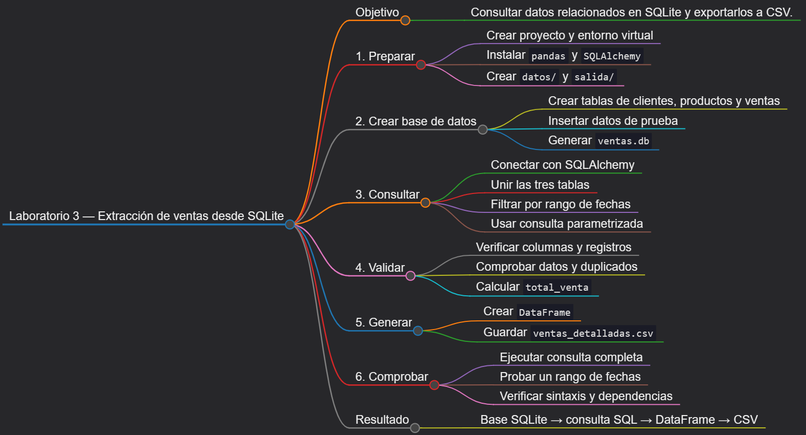
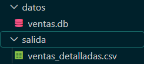

# Laboratorio 3: Extracción desde una base de datos relacional

## Objetivo de la práctica:

Crear una base de datos SQLite reproducible con clientes, productos y ventas, conectarse mediante SQLAlchemy, ejecutar una consulta parametrizada con varias tablas, recuperar el resultado con pandas y exportarlo a CSV.

## Objetivo Visual:



## Duración aproximada:

- 50 minutos.

## Instrucciones

### Tarea 1. **Preparación del entorno y proyecto**

Paso 1. En Windows, abra **Visual Studio Code**, cree `laboratorio_3` dentro de la carpeta del capítulo y ábralo con **File -> Open Folder**.

Paso 2. Prepare el entorno desde PowerShell. SQLite está incluido en Python, por lo que no se requiere instalar un servidor de base de datos.

```powershell
py -3 -m venv .venv
.\.venv\Scripts\Activate.ps1
python -m pip install --upgrade pip
New-Item -ItemType Directory -Force -Path datos, salida
New-Item -ItemType File -Force -Path crear_bd.py, extraer_ventas.py, requirements.txt
```

Si PowerShell bloquea la activación, ejecute `Set-ExecutionPolicy -Scope Process -ExecutionPolicy Bypass` y repita el comando de activación.

Paso 3. Seleccione `.venv\Scripts\python.exe` con **Python: Select Interpreter** y agregue estas dependencias a `requirements.txt`:

```text
pandas>=2.2,<3
SQLAlchemy>=2.0,<3
```

Paso 4. Instale las dependencias:

```powershell
python -m pip install -r requirements.txt
```

### Tarea 2. **Preparación de la base de datos**

Paso 6. Abra `crear_bd.py` y agregue el script que crea el esquema y carga datos de prueba. La transacción garantiza que la carga se complete totalmente o se revierta si hay un error.

```python
import sqlite3
from pathlib import Path


BASE_DIR = Path(__file__).resolve().parent
RUTA_BD = BASE_DIR / "datos" / "ventas.db"


def crear_base() -> None:
    RUTA_BD.parent.mkdir(parents=True, exist_ok=True)
    with sqlite3.connect(RUTA_BD) as conexion:
        conexion.executescript(
            """
            PRAGMA foreign_keys = ON;
            DROP TABLE IF EXISTS ventas;
            DROP TABLE IF EXISTS productos;
            DROP TABLE IF EXISTS clientes;

            CREATE TABLE clientes (
                id_cliente INTEGER PRIMARY KEY,
                nombre TEXT NOT NULL,
                region TEXT NOT NULL
            );

            CREATE TABLE productos (
                id_producto INTEGER PRIMARY KEY,
                nombre TEXT NOT NULL,
                categoria TEXT NOT NULL,
                precio_lista REAL NOT NULL CHECK (precio_lista > 0)
            );

            CREATE TABLE ventas (
                id_venta INTEGER PRIMARY KEY,
                id_cliente INTEGER NOT NULL,
                id_producto INTEGER NOT NULL,
                fecha TEXT NOT NULL,
                cantidad INTEGER NOT NULL CHECK (cantidad > 0),
                precio_unitario REAL NOT NULL CHECK (precio_unitario > 0),
                FOREIGN KEY (id_cliente) REFERENCES clientes(id_cliente),
                FOREIGN KEY (id_producto) REFERENCES productos(id_producto)
            );
            """
        )
        conexion.executemany(
            "INSERT INTO clientes VALUES (?, ?, ?)",
            [
                (1, "Ana Pérez", "Norte"),
                (2, "Luis Gómez", "Centro"),
                (3, "María Ruiz", "Sur"),
            ],
        )
        conexion.executemany(
            "INSERT INTO productos VALUES (?, ?, ?, ?)",
            [
                (101, "Laptop", "Cómputo", 900.00),
                (102, "Monitor", "Cómputo", 220.00),
                (103, "Teclado", "Accesorios", 35.00),
            ],
        )
        conexion.executemany(
            "INSERT INTO ventas VALUES (?, ?, ?, ?, ?, ?)",
            [
                (1001, 1, 101, "2026-09-01", 2, 850.50),
                (1002, 2, 102, "2026-09-03", 3, 205.00),
                (1003, 1, 103, "2026-09-05", 5, 31.50),
                (1004, 3, 102, "2026-09-08", 1, 215.00),
                (1005, 2, 103, "2026-09-10", 4, 32.00),
            ],
        )
    print(f"Base creada: {RUTA_BD}")


if __name__ == "__main__":
    crear_base()
```

Paso 7. Ejecute el script y confirme que se creó `datos/ventas.db`:

```powershell
python crear_bd.py
Get-Item .\datos\ventas.db
```

### Tarea 3. **Conexión modular con SQLAlchemy**

Paso 8. Abra `extraer_ventas.py` y agregue la configuración, el motor y la consulta SQL. Los parámetros `:fecha_inicio` y `:fecha_fin` evitan concatenar entradas directamente en SQL.

```python
import argparse
from pathlib import Path

import pandas as pd
from sqlalchemy import Engine, create_engine, text
from sqlalchemy.exc import SQLAlchemyError


BASE_DIR = Path(__file__).resolve().parent
RUTA_BD = BASE_DIR / "datos" / "ventas.db"
SALIDA = BASE_DIR / "salida"

CONSULTA_VENTAS = text(
    """
    SELECT
        v.id_venta,
        date(v.fecha) AS fecha,
        c.id_cliente,
        c.nombre AS cliente,
        c.region,
        p.id_producto,
        p.nombre AS producto,
        p.categoria,
        v.cantidad,
        v.precio_unitario,
        ROUND(v.cantidad * v.precio_unitario, 2) AS total_venta
    FROM ventas AS v
    INNER JOIN clientes AS c ON c.id_cliente = v.id_cliente
    INNER JOIN productos AS p ON p.id_producto = v.id_producto
    WHERE date(v.fecha) BETWEEN date(:fecha_inicio) AND date(:fecha_fin)
    ORDER BY date(v.fecha), v.id_venta
    """
)


def crear_motor(ruta: Path) -> Engine:
    if not ruta.exists():
        raise FileNotFoundError(
            f"No existe {ruta}. Ejecute primero crear_bd.py."
        )
    return create_engine(f"sqlite:///{ruta.as_posix()}")
```

Paso 9. Agregue una función de extracción con una sola responsabilidad: ejecutar la consulta y devolver un DataFrame.

```python
def extraer(
    motor: Engine,
    fecha_inicio: str,
    fecha_fin: str,
) -> pd.DataFrame:
    if pd.to_datetime(fecha_inicio) > pd.to_datetime(fecha_fin):
        raise ValueError("La fecha inicial no puede ser posterior a la final.")

    with motor.connect() as conexion:
        return pd.read_sql(
            CONSULTA_VENTAS,
            conexion,
            params={
                "fecha_inicio": fecha_inicio,
                "fecha_fin": fecha_fin,
            },
            parse_dates=["fecha"],
        )
```

Paso 10. Agregue validación y exportación en funciones separadas:

```python
def validar(df: pd.DataFrame) -> None:
    columnas = {
        "id_venta",
        "fecha",
        "cliente",
        "producto",
        "cantidad",
        "precio_unitario",
        "total_venta",
    }
    faltantes = columnas - set(df.columns)
    if faltantes:
        raise ValueError(f"La consulta no devolvió: {sorted(faltantes)}")
    if df.empty:
        raise ValueError("No existen ventas en el período solicitado.")
    if df["id_venta"].duplicated().any():
        raise ValueError("La consulta devolvió ventas duplicadas.")


def exportar(df: pd.DataFrame, ruta: Path) -> None:
    ruta.parent.mkdir(parents=True, exist_ok=True)
    df.to_csv(
        ruta,
        index=False,
        encoding="utf-8-sig",
        date_format="%Y-%m-%d",
    )
```

### Tarea 4. **Orquestación y parámetros de ejecución**

Paso 11. Agregue un analizador de argumentos y la función principal:

```python
def obtener_argumentos() -> argparse.Namespace:
    parser = argparse.ArgumentParser(description="Extrae ventas desde SQLite.")
    parser.add_argument("--inicio", default="2026-09-01")
    parser.add_argument("--fin", default="2026-09-30")
    return parser.parse_args()


def main() -> int:
    argumentos = obtener_argumentos()
    motor = None
    try:
        motor = crear_motor(RUTA_BD)
        ventas = extraer(motor, argumentos.inicio, argumentos.fin)
        validar(ventas)
        destino = SALIDA / "ventas_detalladas.csv"
        exportar(ventas, destino)
    except (OSError, ValueError, pd.errors.DatabaseError, SQLAlchemyError) as error:
        print(f"ERROR: {error}")
        return 1
    finally:
        if motor is not None:
            motor.dispose()

    print(ventas.to_string(index=False))
    print(f"\nRegistros exportados: {len(ventas)}")
    print(f"Archivo generado: {destino}")
    return 0


if __name__ == "__main__":
    raise SystemExit(main())
```

### Tarea 5. **Ejecución y validaciones**

Paso 12. Ejecute la extracción del mes completo:

```powershell
python extraer_ventas.py --inicio 2026-09-01 --fin 2026-09-30
```

Paso 13. Abra `salida/ventas_detalladas.csv` y confirme que cada fila combina datos de las tres tablas y que `total_venta` corresponde a `cantidad * precio_unitario`.

Paso 14. Ejecute un período reducido y confirme que el filtro se realiza dentro de SQLite:

```powershell
python extraer_ventas.py --inicio 2026-09-03 --fin 2026-09-0
```

Paso 16. Compruebe la sintaxis y las dependencias:

```powershell
python -m py_compile crear_bd.py extraer_ventas.py
python -m pip check
```

### Resultado esperado


