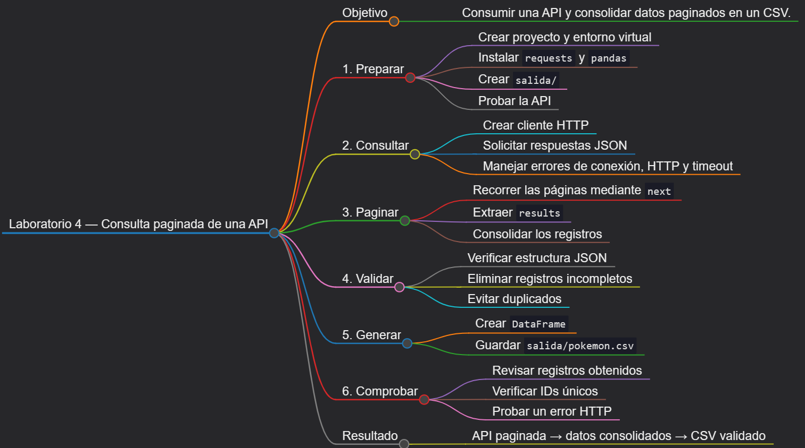
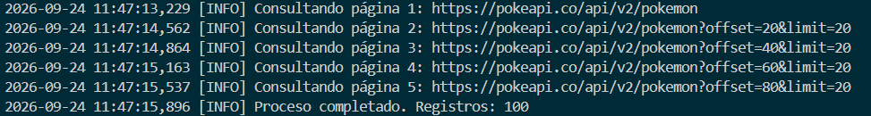

# Laboratorio 4: Consulta paginada de una API

## Objetivo de la práctica:

Consumir una API REST pública desde Python, recorrer varias páginas de resultados, validar las respuestas JSON, extraer propiedades específicas, consolidar los registros y guardarlos como CSV con manejo de errores de conexión, HTTP, tiempo de espera y ausencia de datos.

## Objetivo Visual:



## Duración aproximada:

- 45 minutos.

## Instrucciones

### Tarea 1. **Preparación del entorno y proyecto**

Paso 1. En Windows, abra **Visual Studio Code**, cree `laboratorio_4` dentro de la carpeta del capítulo y ábralo con **File -> Open Folder**.

Paso 3. Prepare el entorno desde PowerShell:

```powershell
py -3 -m venv .venv
.\.venv\Scripts\Activate.ps1
python -m pip install --upgrade pip
New-Item -ItemType Directory -Force -Path salida
New-Item -ItemType File -Force -Path api_paginada.py, requirements.txt
```

Si PowerShell bloquea la activación, ejecute `Set-ExecutionPolicy -Scope Process -ExecutionPolicy Bypass` y vuelva a activar el entorno.

Paso 4. Seleccione `.venv\Scripts\python.exe` con **Python: Select Interpreter** y agregue a `requirements.txt`:

```text
pandas>=2.2,<3
requests>=2.31,<3
```

Paso 5. Instale las dependencias:

```powershell
python -m pip install -r requirements.txt
```

### Tarea 2. **Exploración del servicio HTTP**

Paso 7. Realice una consulta de prueba desde PowerShell y observe `count`, `next`, `previous` y `results`:

```powershell
Invoke-RestMethod -Uri "https://pokeapi.co/api/v2/pokemon?limit=5&offset=0" | ConvertTo-Json -Depth 4
```

Paso 8. Confirme que `results` es una lista y que `next` contiene la URL de la página siguiente. La práctica seguirá ese enlace en lugar de construir manualmente cada `offset`.

### Tarea 3. **Configuración del cliente HTTP**

Paso 9. Abra `api_paginada.py` y agregue la configuración y el logger:

```python
import logging
import time
from pathlib import Path

import pandas as pd
import requests
from requests.adapters import HTTPAdapter
from urllib3.util.retry import Retry


BASE_DIR = Path(__file__).resolve().parent
URL_INICIAL = "https://pokeapi.co/api/v2/pokemon"
PAGINAS_MAXIMAS = 5
TAMANIO_PAGINA = 20

logging.basicConfig(
    level=logging.INFO,
    format="%(asctime)s [%(levelname)s] %(message)s",
)
logger = logging.getLogger(__name__)
```

Paso 10. Agregue una sesión con reintentos limitados para errores transitorios. No se reintentan errores permanentes como `400` o `404`.

```python
def crear_sesion() -> requests.Session:
    reintentos = Retry(
        total=3,
        backoff_factor=0.5,
        status_forcelist=(429, 500, 502, 503, 504),
        allowed_methods=frozenset({"GET"}),
        respect_retry_after_header=True,
    )
    adaptador = HTTPAdapter(max_retries=reintentos)
    sesion = requests.Session()
    sesion.headers.update(
        {
            "Accept": "application/json",
            "User-Agent": "laboratorio-api-paginada/1.0",
        }
    )
    sesion.mount("https://", adaptador)
    return sesion
```

Paso 11. Agregue una función que clasifique los errores de red, valide el tipo de contenido y compruebe la estructura JSON:

```python
def solicitar_json(
    sesion: requests.Session,
    url: str,
    params: dict | None = None,
) -> dict:
    try:
        respuesta = sesion.get(url, params=params, timeout=(5, 15))
        respuesta.raise_for_status()
    except requests.Timeout as error:
        raise RuntimeError("Se agotó el tiempo de espera de la API.") from error
    except requests.ConnectionError as error:
        raise RuntimeError("No fue posible conectar con la API.") from error
    except requests.HTTPError as error:
        codigo = error.response.status_code if error.response is not None else "?"
        raise RuntimeError(f"La API respondió con HTTP {codigo}.") from error
    except requests.RequestException as error:
        raise RuntimeError(f"Fallo inesperado de red: {error}") from error

    if "application/json" not in respuesta.headers.get("Content-Type", ""):
        raise ValueError("La respuesta no declara contenido JSON.")
    try:
        contenido = respuesta.json()
    except requests.exceptions.JSONDecodeError as error:
        raise ValueError("La respuesta no contiene JSON válido.") from error
    if not isinstance(contenido, dict):
        raise ValueError("La raíz de la respuesta debe ser un objeto JSON.")
    return contenido
```

### Tarea 4. **Paginación y transformación**

Paso 12. Agregue una función que recorra hasta cinco páginas, respete una pausa de cortesía y detenga el proceso si falta la colección `results`.

```python
def extraer_paginas(sesion: requests.Session) -> list[dict]:
    url = URL_INICIAL
    params = {"limit": TAMANIO_PAGINA, "offset": 0}
    consolidados = []

    for numero_pagina in range(1, PAGINAS_MAXIMAS + 1):
        logger.info("Consultando página %d: %s", numero_pagina, url)
        contenido = solicitar_json(sesion, url, params=params)
        resultados = contenido.get("results")
        if not isinstance(resultados, list):
            raise ValueError("La respuesta no contiene una lista 'results'.")
        if not resultados:
            logger.warning("La página %d no contiene datos.", numero_pagina)
            break

        for registro in resultados:
            nombre = registro.get("name") if isinstance(registro, dict) else None
            url_detalle = registro.get("url") if isinstance(registro, dict) else None
            if not nombre or not url_detalle:
                logger.warning("Registro omitido por estructura incompleta: %r", registro)
                continue
            texto_id = url_detalle.rstrip("/").rsplit("/", 1)[-1]
            consolidados.append(
                {
                    "id_pokemon": int(texto_id) if texto_id.isdigit() else None,
                    "nombre": nombre,
                    "url_detalle": url_detalle,
                    "pagina_origen": numero_pagina,
                }
            )

        url = contenido.get("next")
        params = None
        if not url:
            logger.info("La API indicó que no hay más páginas.")
            break
        time.sleep(0.2)

    return consolidados
```

Paso 13. Agregue la consolidación y las validaciones finales:

```python
def consolidar(registros: list[dict]) -> pd.DataFrame:
    if not registros:
        raise ValueError("No se obtuvo ningún registro de la API.")

    df = pd.DataFrame(registros)
    df["id_pokemon"] = pd.to_numeric(df["id_pokemon"], errors="coerce").astype("Int64")
    df = df.dropna(subset=["id_pokemon", "nombre", "url_detalle"])
    df = df.drop_duplicates(subset=["id_pokemon"]).sort_values("id_pokemon")
    if df.empty:
        raise ValueError("Todos los registros fueron descartados durante la validación.")
    return df.reset_index(drop=True)
```

### Tarea 5. **Orquestación y almacenamiento**

Paso 14. Agregue la función principal:

```python
def main() -> int:
    try:
        with crear_sesion() as sesion:
            registros = extraer_paginas(sesion)
        df = consolidar(registros)
        destino = BASE_DIR / "salida" / "pokemon.csv"
        destino.parent.mkdir(parents=True, exist_ok=True)
        df.to_csv(destino, index=False, encoding="utf-8-sig")
    except (RuntimeError, ValueError, OSError) as error:
        logger.error("El proceso terminó con error: %s", error)
        return 1

    logger.info("Proceso completado. Registros: %d", len(df))
    logger.info("Archivo generado: %s", destino)
    return 0


if __name__ == "__main__":
    raise SystemExit(main())
```

### Tarea 6. **Ejecución y validaciones de error**

Paso 15. Ejecute el cliente:

```powershell
python api_paginada.py
```

Paso 16. Abra `salida/pokemon.csv`. Con la configuración inicial deben consolidarse hasta 100 registros, sin identificadores duplicados y con el número de página de origen.

Paso 17. Pruebe una respuesta incorrecta cambiando temporalmente `URL_INICIAL` por `https://pokeapi.co/api/v2/ruta-inexistente`. Confirme que el error HTTP queda registrado y restaure después la URL

### Resultado esperado


