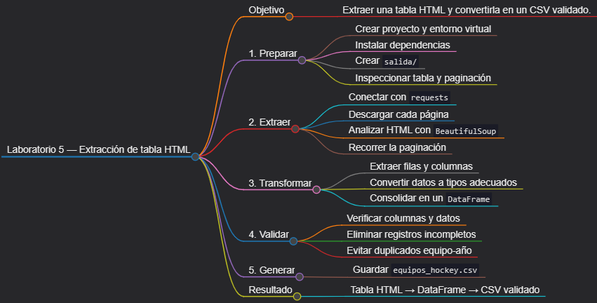
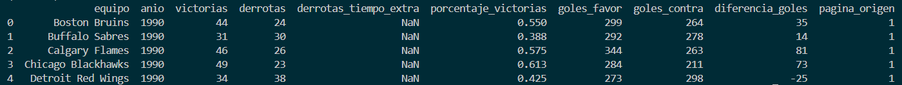

# Laboratorio 5: Extracción de una tabla HTML

## Objetivo de la práctica:

Descargar páginas HTML de un sitio público creado para practicar web scraping, analizar una tabla con BeautifulSoup, recorrer su paginación, convertir los datos extraídos en un DataFrame y guardarlos como CSV con validaciones y una pausa de cortesía.

## Objetivo Visual:



## Duración aproximada:

- 45 minutos.

## Instrucciones

### Tarea 1. **Preparación del entorno y proyecto**

Paso 1. En Windows, abra **Visual Studio Code**, cree `laboratorio_5` dentro de la carpeta del capítulo y ábralo con **File -> Open Folder**.

Paso 3. Prepare el entorno desde PowerShell:

```powershell
py -3 -m venv .venv
.\.venv\Scripts\Activate.ps1
python -m pip install --upgrade pip
New-Item -ItemType Directory -Force -Path salida
New-Item -ItemType File -Force -Path extraer_tabla.py, requirements.txt
```

Si PowerShell bloquea la activación, ejecute `Set-ExecutionPolicy -Scope Process -ExecutionPolicy Bypass` y repita la activación.

Paso 4. Seleccione `.venv\Scripts\python.exe` con **Python: Select Interpreter** y agregue a `requirements.txt`:

```text
beautifulsoup4>=4.12,<5
lxml>=5,<7
pandas>=2.2,<3
requests>=2.31,<3
```

Paso 5. Instale las dependencias:

```powershell
python -m pip install -r requirements.txt
```

### Tarea 2. **Inspección responsable del sitio**

Paso 6. Abra en el navegador [www.scrapethissite.com/pages/forms](https://www.scrapethissite.com/pages/forms/) y localice la tabla de estadísticas de equipos de hockey, sus encabezados y los enlaces de paginación. La extracción se limitará a una solicitud por página, usará un `User-Agent` descriptivo y esperará entre solicitudes. Estas medidas reducen carga innecesaria sobre el sitio.

### Tarea 3. **Cliente HTTP y parseo de una página**

Paso 9. Abra `extraer_tabla.py` y agregue las importaciones, configuración y logger:

```python
import logging
import time
from pathlib import Path

import pandas as pd
import requests
from bs4 import BeautifulSoup


BASE_DIR = Path(__file__).resolve().parent
URL = "https://www.scrapethissite.com/pages/forms/"
MAX_PAGINAS = 30

logging.basicConfig(
    level=logging.INFO,
    format="%(asctime)s [%(levelname)s] %(message)s",
)
logger = logging.getLogger(__name__)
```

Paso 10. Agregue una función auxiliar para obtener el texto de una celda y otra para convertir una fila HTML en un diccionario:

```python
def texto_celda(fila, clase: str) -> str | None:
    celda = fila.select_one(f"td.{clase}")
    if celda is None:
        return None
    texto = celda.get_text(" ", strip=True)
    return texto or None


def transformar_fila(fila, pagina: int) -> dict:
    return {
        "equipo": texto_celda(fila, "name"),
        "anio": texto_celda(fila, "year"),
        "victorias": texto_celda(fila, "wins"),
        "derrotas": texto_celda(fila, "losses"),
        "derrotas_tiempo_extra": texto_celda(fila, "ot-losses"),
        "porcentaje_victorias": texto_celda(fila, "pct"),
        "goles_favor": texto_celda(fila, "gf"),
        "goles_contra": texto_celda(fila, "ga"),
        "diferencia_goles": texto_celda(fila, "diff"),
        "pagina_origen": pagina,
    }
```

Paso 11. Agregue la descarga y el parseo de una página. El selector comprueba explícitamente que la tabla esperada exista.

```python
def extraer_pagina(
    sesion: requests.Session,
    numero: int,
) -> list[dict]:
    try:
        respuesta = sesion.get(
            URL,
            params={"page_num": numero, "per_page": 25},
            timeout=(5, 20),
        )
        respuesta.raise_for_status()
    except requests.Timeout as error:
        raise RuntimeError(f"Timeout al consultar la página {numero}.") from error
    except requests.RequestException as error:
        raise RuntimeError(
            f"No se pudo descargar la página {numero}: {error}"
        ) from error

    soup = BeautifulSoup(respuesta.text, "lxml")
    tabla = soup.select_one("table.table")
    if tabla is None:
        raise ValueError("No se encontró la tabla esperada en el HTML.")

    filas = tabla.select("tr.team")
    return [transformar_fila(fila, numero) for fila in filas]
```

### Tarea 4. **Paginación y consolidación**

Paso 12. Agregue una función que recorra las páginas hasta recibir una tabla sin filas. `MAX_PAGINAS` actúa como límite de seguridad ante un cambio inesperado en el sitio.

```python
def extraer_todas_las_paginas() -> list[dict]:
    registros = []
    vistos = set()

    with requests.Session() as sesion:
        sesion.headers.update(
            {
                "User-Agent": "laboratorio-scraping/1.0 (uso educativo)",
                "Accept": "text/html,application/xhtml+xml",
            }
        )
        for pagina in range(1, MAX_PAGINAS + 1):
            logger.info("Descargando página %d", pagina)
            filas = extraer_pagina(sesion, pagina)
            if not filas:
                logger.info("No hay filas en la página %d; fin.", pagina)
                break

            nuevas = 0
            for fila in filas:
                clave = (fila["equipo"], fila["anio"])
                if clave not in vistos:
                    vistos.add(clave)
                    registros.append(fila)
                    nuevas += 1

            if nuevas == 0:
                logger.warning("La página %d solo repite datos; fin.", pagina)
                break
            time.sleep(0.5)

    return registros
```

Paso 13. Convierta los datos a tipos adecuados y valide las columnas esenciales:

```python
def crear_dataframe(registros: list[dict]) -> pd.DataFrame:
    if not registros:
        raise ValueError("El sitio no produjo registros.")

    df = pd.DataFrame(registros)
    columnas_enteras = [
        "anio",
        "victorias",
        "derrotas",
        "derrotas_tiempo_extra",
        "goles_favor",
        "goles_contra",
        "diferencia_goles",
        "pagina_origen",
    ]
    for columna in columnas_enteras:
        df[columna] = pd.to_numeric(df[columna], errors="coerce").astype("Int64")
    df["porcentaje_victorias"] = pd.to_numeric(
        df["porcentaje_victorias"], errors="coerce"
    )

    incompletos = df["equipo"].isna() | df["anio"].isna()
    if incompletos.any():
        logger.warning("Se descartan %d filas incompletas.", int(incompletos.sum()))
        df = df[~incompletos]
    if df.empty:
        raise ValueError("No quedaron filas válidas después de la limpieza.")
    return df.sort_values(["anio", "equipo"]).reset_index(drop=True)
```

### Tarea 5. **Almacenamiento y ejecución**

Paso 14. Agregue la función principal:

```python
def main() -> int:
    try:
        registros = extraer_todas_las_paginas()
        df = crear_dataframe(registros)
        destino = BASE_DIR / "salida" / "equipos_hockey.csv"
        destino.parent.mkdir(parents=True, exist_ok=True)
        df.to_csv(destino, index=False, encoding="utf-8-sig")
    except (RuntimeError, ValueError, OSError) as error:
        logger.error("Extracción fallida: %s", error)
        return 1

    logger.info("Extracción terminada. Filas: %d", len(df))
    logger.info("Archivo generado: %s", destino)
    return 0


if __name__ == "__main__":
    raise SystemExit(main())
```

Paso 15. Ejecute el extractor:

```powershell
python extraer_tabla.py
```

### Tarea 6. **Validaciones finales**

Paso 16. Abra `salida/equipos_hockey.csv` y confirme que las columnas coinciden con la tabla, que `anio` es numérico y que no existe más de una fila para la combinación equipo-año.

Paso 17. Compruebe el archivo desde Python:

```powershell
python -c "import pandas as pd; d=pd.read_csv('salida/equipos_hockey.csv'); print(d.shape); print(d.head())"
```

### Resultado esperado


