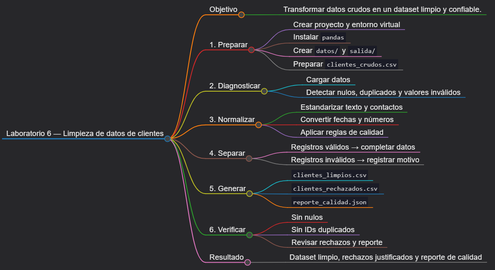
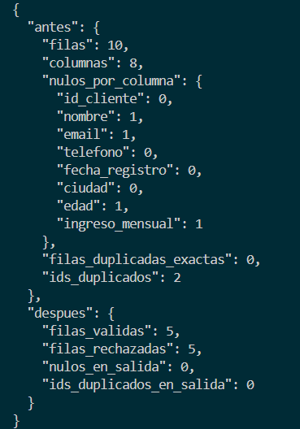

# Laboratorio 6: Preparación de un dataset real

## Objetivo de la práctica:

Diagnosticar y limpiar un dataset de clientes que contiene valores nulos, identificadores duplicados, texto inconsistente, números fuera de rango y fechas inválidas; normalizar sus campos y generar un dataset final, un archivo de rechazos y un reporte de calidad.

## Objetivo Visual:



## Duración aproximada:

- 60 minutos.

## Instrucciones

### Tarea 1. **Preparación del entorno y proyecto**

Paso 1. En Windows, abra **Visual Studio Code**, cree `laboratorio_6` dentro de la carpeta del capítulo y ábralo con **File -> Open Folder**.

Paso 2. Prepare un entorno aislado con PowerShell.

```powershell
py -3 -m venv .venv
.\.venv\Scripts\Activate.ps1
python -m pip install --upgrade pip
New-Item -ItemType Directory -Force -Path datos, salida
New-Item -ItemType File -Force -Path limpiar_clientes.py, requirements.txt
```

Si PowerShell bloquea la activación, ejecute `Set-ExecutionPolicy -Scope Process -ExecutionPolicy Bypass` y vuelva a activar el entorno.

Paso 3. Seleccione `.venv\Scripts\python.exe` con **Python: Select Interpreter**. Agregue a `requirements.txt` e instale la dependencia:

```text
pandas>=2.2,<3
```

```powershell
python -m pip install -r requirements.txt
```

### Tarea 2. **Preparación del documento de entrada**

Paso 5. Cree `datos/clientes_crudos.csv` con este contenido:

```csv
id_cliente,nombre,email,telefono,fecha_registro,ciudad,edad,ingreso_mensual
C001, ana perez ,ANA@EXAMPLE.COM,555-0101,2024-01-15,lima,29,3500
C002,LUIS GOMEZ,luis@example.com,5550102,15/02/2024,LIMA,,4200
C003,Maria Ruiz,maria.example.com,5550103,2024-02-30,quito,34,3800
C001,Ana Perez,ana@example.com,5550101,2024-01-15,Lima,29,3500
C004,  carlos diaz ,,ABC,2024-03-10,bogota,200,-100
C005,Elena León,elena@example.com,5550105,2024-03-12, MÉXICO ,41,
C006,JOSÉ TORRES,jose@example.com,5550106,no-disponible,Lima,36,5100
C007,,sofia@example.com,5550107,2024-03-20,QUITO,27,2900
C008,Pedro Salas,pedro@example.com,555-0108,2024-03-25,Bogotá,17,3100
C009,Lucía Vega,lucia@example.com,5550109,2024-03-28,Lima,38,4600
```

Tarea 3. **Carga y diagnóstico inicial**

Paso 6. Abra `limpiar_clientes.py` y agregue las importaciones, rutas y esquema:

```python
import json
from pathlib import Path

import pandas as pd


BASE_DIR = Path(__file__).resolve().parent
ENTRADA = BASE_DIR / "datos" / "clientes_crudos.csv"
SALIDA = BASE_DIR / "salida"
COLUMNAS = [
    "id_cliente",
    "nombre",
    "email",
    "telefono",
    "fecha_registro",
    "ciudad",
    "edad",
    "ingreso_mensual",
]
```

Paso 7. Agregue la carga y un diagnóstico reutilizable:

```python
def cargar(ruta: Path) -> pd.DataFrame:
    if not ruta.exists():
        raise FileNotFoundError(f"No se encontró {ruta}")
    df = pd.read_csv(ruta, dtype="string", encoding="utf-8")
    faltantes = set(COLUMNAS) - set(df.columns)
    if faltantes:
        raise ValueError(f"Faltan columnas: {sorted(faltantes)}")
    if df.empty:
        raise ValueError("El dataset está vacío.")
    return df[COLUMNAS].copy()


def diagnosticar(df: pd.DataFrame) -> dict:
    return {
        "filas": int(len(df)),
        "columnas": int(len(df.columns)),
        "nulos_por_columna": {
            columna: int(valor)
            for columna, valor in df.isna().sum().items()
        },
        "filas_duplicadas_exactas": int(df.duplicated().sum()),
        "ids_duplicados": int(df["id_cliente"].duplicated(keep=False).sum()),
    }
```

### Tarea 4. **Normalización y reglas de calidad**

Paso 8. Agregue la función de normalización. Los valores numéricos y fechas no convertibles se transforman en nulos para poder detectarlos sin interrumpir todo el lote.

```python
def normalizar(df: pd.DataFrame) -> pd.DataFrame:
    trabajo = df.copy()
    trabajo["fila_origen"] = trabajo.index + 2
    trabajo["id_cliente"] = trabajo["id_cliente"].str.strip().str.upper()
    trabajo["nombre"] = trabajo["nombre"].str.strip().str.title()
    trabajo["email"] = trabajo["email"].str.strip().str.lower()
    trabajo["ciudad"] = trabajo["ciudad"].str.strip().str.title()
    trabajo["telefono"] = trabajo["telefono"].str.replace(
        r"\D", "", regex=True
    )
    trabajo["fecha_registro"] = pd.to_datetime(
        trabajo["fecha_registro"],
        format="mixed",
        dayfirst=True,
        errors="coerce",
    )
    trabajo["edad"] = pd.to_numeric(trabajo["edad"], errors="coerce")
    trabajo["ingreso_mensual"] = pd.to_numeric(
        trabajo["ingreso_mensual"], errors="coerce"
    )

    trabajo.loc[~trabajo["edad"].between(18, 100), "edad"] = pd.NA
    trabajo.loc[trabajo["ingreso_mensual"].le(0), "ingreso_mensual"] = pd.NA
    return trabajo
```

Paso 9. Agregue la separación de registros. Los campos de identidad y contacto son obligatorios; la edad y el ingreso pueden imputarse con la mediana de los valores válidos.

```python
def separar(
    df: pd.DataFrame,
) -> tuple[pd.DataFrame, pd.DataFrame]:
    trabajo = df.copy()
    motivos = pd.Series("", index=trabajo.index, dtype="string")
    correo_valido = trabajo["email"].str.fullmatch(
        r"[^@\s]+@[^@\s]+\.[^@\s]+", na=False
    )
    telefono_valido = trabajo["telefono"].str.fullmatch(r"\d{7,15}", na=False)
    fecha_futura = trabajo["fecha_registro"].gt(pd.Timestamp.today().normalize())

    reglas = [
        (~trabajo["id_cliente"].str.fullmatch(r"C\d{3,}", na=False), "id inválido; "),
        (trabajo["id_cliente"].duplicated(keep="first"), "id duplicado; "),
        (trabajo["nombre"].isna() | trabajo["nombre"].eq(""), "nombre vacío; "),
        (~correo_valido, "email inválido; "),
        (~telefono_valido, "teléfono inválido; "),
        (trabajo["fecha_registro"].isna(), "fecha inválida; "),
        (fecha_futura.fillna(False), "fecha futura; "),
        (trabajo["ciudad"].isna() | trabajo["ciudad"].eq(""), "ciudad vacía; "),
    ]
    for condicion, texto in reglas:
        motivos = motivos.mask(condicion, motivos + texto)

    trabajo["motivo_rechazo"] = motivos.str.rstrip("; ")
    validos = trabajo[trabajo["motivo_rechazo"].eq("")].copy()
    rechazados = trabajo[trabajo["motivo_rechazo"].ne("")].copy()

    for columna in ["edad", "ingreso_mensual"]:
        mediana = validos[columna].median()
        validos[columna] = validos[columna].fillna(mediana)

    validos["edad"] = validos["edad"].round().astype("Int64")
    validos["ingreso_mensual"] = validos["ingreso_mensual"].round(2)
    validos = validos.drop(columns="motivo_rechazo")
    return validos.reset_index(drop=True), rechazados.reset_index(drop=True)
```

### Tarea 5. **Reporte y almacenamiento**

Paso 10. Agregue la función que guarda todos los productos del proceso:

```python
def guardar(
    validos: pd.DataFrame,
    rechazados: pd.DataFrame,
    reporte: dict,
) -> None:
    SALIDA.mkdir(parents=True, exist_ok=True)
    validos.to_csv(
        SALIDA / "clientes_limpios.csv",
        index=False,
        encoding="utf-8-sig",
        date_format="%Y-%m-%d",
    )
    rechazados.to_csv(
        SALIDA / "clientes_rechazados.csv",
        index=False,
        encoding="utf-8-sig",
        date_format="%Y-%m-%d",
    )
    with (SALIDA / "reporte_calidad.json").open("w", encoding="utf-8") as archivo:
        json.dump(reporte, archivo, ensure_ascii=False, indent=2)
```

Paso 11. Agregue la función principal:

```python
def main() -> int:
    try:
        crudos = cargar(ENTRADA)
        reporte = {"antes": diagnosticar(crudos)}
        normalizados = normalizar(crudos)
        validos, rechazados = separar(normalizados)
        reporte["despues"] = {
            "filas_validas": int(len(validos)),
            "filas_rechazadas": int(len(rechazados)),
            "nulos_en_salida": int(validos.isna().sum().sum()),
            "ids_duplicados_en_salida": int(
                validos["id_cliente"].duplicated().sum()
            ),
        }
        guardar(validos, rechazados, reporte)
    except (OSError, ValueError, pd.errors.ParserError) as error:
        print(f"ERROR: {error}")
        return 1

    print(json.dumps(reporte, ensure_ascii=False, indent=2))
    return 0


if __name__ == "__main__":
    raise SystemExit(main())
```

### Tarea 6. **Ejecución y validaciones**

Paso 12. Ejecute la limpieza:

```powershell
python limpiar_clientes.py
```

Paso 13. Revise `salida/clientes_limpios.csv`. Los nombres y ciudades deben tener capitalización uniforme, los correos deben estar en minúsculas, los teléfonos deben contener solo dígitos y no deben existir IDs duplicados.

Paso 14. Revise `salida/clientes_rechazados.csv`. Cada fila descartada debe conservar `fila_origen` y uno o más motivos.

Paso 15. Revise el reporte con una herramienta incluida en Python:

```powershell
python -m json.tool .\salida\reporte_calidad.json
```

Paso 16. Compruebe que el dataset limpio no tiene nulos ni IDs duplicados:

```powershell
python -c "import pandas as pd; d=pd.read_csv('salida/clientes_limpios.csv'); print(d.isna().sum()); print('IDs duplicados:', d.id_cliente.duplicated().sum())"
```

## Resultado esperado


