# Laboratorio 7: Automatización de un proceso ETL de archivos

## Objetivo de la práctica:

Construir un proceso ETL automatizado que detecte archivos CSV en una carpeta de entrada, consolide y limpie sus registros, calcule campos derivados, genere un archivo Parquet, mueva los archivos procesados y registre cada etapa en consola y en un archivo de log.

## Objetivo Visual:

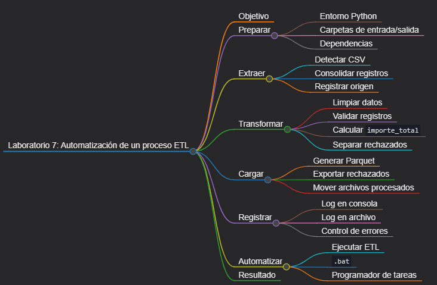

## Duración aproximada:

- 45 minutos.

## Instrucciones

### Tarea 1. **Preparación del entorno y estructura**

Paso 1. En Windows, abra **Visual Studio Code**, cree `laboratorio_7` dentro de la carpeta del capítulo y ábralo con **File -> Open Folder**.

Paso 3. Prepare el entorno y las carpetas desde PowerShell:

```powershell
py -3 -m venv .venv
.\.venv\Scripts\Activate.ps1
python -m pip install --upgrade pip
New-Item -ItemType Directory -Force -Path entrada, procesados, salida, logs
New-Item -ItemType File -Force -Path etl_archivos.py, ejecutar_etl.bat, requirements.txt
```

Si PowerShell bloquea la activación, ejecute `Set-ExecutionPolicy -Scope Process -ExecutionPolicy Bypass` y vuelva a activar el entorno.

Paso 4. Seleccione `.venv\Scripts\python.exe` con **Python: Select Interpreter**. Agregue a `requirements.txt`:

```text
pandas>=2.2,<3
pyarrow>=15,<25
```

Paso 5. Instale las dependencias:

```powershell
python -m pip install -r requirements.txt
```

### Tarea 2. **Preparación de archivos de entrada**

Paso 7. Cree `entrada/ventas_norte.csv` con estos datos:

```csv
id_venta,fecha,sucursal,producto,cantidad,precio_unitario
V1001,2026-09-01,Norte,Laptop,1,850.00
V1002,2026-09-01,Norte,Mouse,4,18.50
V1003,fecha-invalida,Norte,Monitor,2,210.00
```

Paso 8. Cree `entrada/ventas_sur.csv` con estos datos:

```csv
id_venta,fecha,sucursal,producto,cantidad,precio_unitario
V1004,2026-09-02,Sur,Teclado,3,29.90
V1005,2026-09-02, sur ,Webcam,2,48.00
V1002,2026-09-03,Sur,Mouse,1,18.50
V1006,2026-09-03,Sur,Base,0,35.00
```

### Tarea 3. **Configuración de logging y extracción**

Paso 9. Abra `etl_archivos.py` y agregue la configuración general. `RotatingFileHandler` evita que el log crezca indefinidamente.

```python
import logging
import shutil
from datetime import datetime
from logging.handlers import RotatingFileHandler
from pathlib import Path

import pandas as pd


BASE_DIR = Path(__file__).resolve().parent
ENTRADA = BASE_DIR / "entrada"
PROCESADOS = BASE_DIR / "procesados"
SALIDA = BASE_DIR / "salida"
LOGS = BASE_DIR / "logs"
COLUMNAS = [
    "id_venta",
    "fecha",
    "sucursal",
    "producto",
    "cantidad",
    "precio_unitario",
]


def configurar_logger() -> logging.Logger:
    LOGS.mkdir(parents=True, exist_ok=True)
    logger = logging.getLogger("etl_archivos")
    logger.setLevel(logging.INFO)
    logger.handlers.clear()
    formato = logging.Formatter(
        "%(asctime)s | %(levelname)s | %(message)s"
    )

    consola = logging.StreamHandler()
    consola.setFormatter(formato)
    archivo = RotatingFileHandler(
        LOGS / "etl_archivos.log",
        maxBytes=1_000_000,
        backupCount=3,
        encoding="utf-8",
    )
    archivo.setFormatter(formato)
    logger.addHandler(consola)
    logger.addHandler(archivo)
    return logger


logger = configurar_logger()
```

Paso 10. Agregue `extract()`. Cada fila conserva el nombre del documento del que proviene para facilitar la trazabilidad.

```python
def extract() -> tuple[pd.DataFrame, list[Path]]:
    archivos = sorted(ENTRADA.glob("*.csv"))
    if not archivos:
        raise FileNotFoundError(f"No hay archivos CSV en {ENTRADA}")

    lotes = []
    for ruta in archivos:
        logger.info("Leyendo %s", ruta.name)
        df = pd.read_csv(ruta, encoding="utf-8", dtype="string")
        faltantes = set(COLUMNAS) - set(df.columns)
        if faltantes:
            raise ValueError(
                f"{ruta.name} no contiene: {sorted(faltantes)}"
            )
        df = df[COLUMNAS].copy()
        df["archivo_origen"] = ruta.name
        df["fila_origen"] = df.index + 2
        lotes.append(df)

    consolidado = pd.concat(lotes, ignore_index=True)
    logger.info("Extracción completada: %d filas", len(consolidado))
    return consolidado, archivos
```

### Tarea 4. **Transformación y validación**

Paso 11. Agregue `transform()`. La salida válida incorpora `importe_total`, y la salida inválida conserva el motivo del rechazo.

```python
def transform(
    df: pd.DataFrame,
) -> tuple[pd.DataFrame, pd.DataFrame]:
    trabajo = df.copy()
    trabajo["id_venta"] = trabajo["id_venta"].str.strip().str.upper()
    trabajo["sucursal"] = trabajo["sucursal"].str.strip().str.title()
    trabajo["producto"] = trabajo["producto"].str.strip().str.title()
    trabajo["fecha"] = pd.to_datetime(trabajo["fecha"], errors="coerce")
    trabajo["cantidad"] = pd.to_numeric(trabajo["cantidad"], errors="coerce")
    trabajo["precio_unitario"] = pd.to_numeric(
        trabajo["precio_unitario"], errors="coerce"
    )

    motivos = pd.Series("", index=trabajo.index, dtype="string")
    reglas = [
        (~trabajo["id_venta"].str.fullmatch(r"V\d{4,}", na=False), "id inválido; "),
        (trabajo["id_venta"].duplicated(keep="first"), "id duplicado; "),
        (trabajo["fecha"].isna(), "fecha inválida; "),
        (trabajo["sucursal"].isna() | trabajo["sucursal"].eq(""), "sucursal vacía; "),
        (trabajo["producto"].isna() | trabajo["producto"].eq(""), "producto vacío; "),
        (trabajo["cantidad"].isna() | trabajo["cantidad"].le(0), "cantidad inválida; "),
        (
            trabajo["precio_unitario"].isna()
            | trabajo["precio_unitario"].le(0),
            "precio inválido; ",
        ),
    ]
    for condicion, texto in reglas:
        motivos = motivos.mask(condicion, motivos + texto)

    trabajo["motivo_rechazo"] = motivos.str.rstrip("; ")
    validos = trabajo[trabajo["motivo_rechazo"].eq("")].copy()
    rechazados = trabajo[trabajo["motivo_rechazo"].ne("")].copy()
    validos["importe_total"] = (
        validos["cantidad"] * validos["precio_unitario"]
    ).round(2)
    validos = validos.drop(columns="motivo_rechazo")

    logger.info(
        "Transformación: %d válidas, %d rechazadas",
        len(validos),
        len(rechazados),
    )
    return validos.reset_index(drop=True), rechazados.reset_index(drop=True)
```

### Tarea 5. **Carga y movimiento seguro de documentos**

Paso 12. Agregue `load()`. Primero se escriben los resultados; los documentos se mueven a `procesados/` únicamente si esa escritura termina correctamente.

```python
def load(
    validos: pd.DataFrame,
    rechazados: pd.DataFrame,
    archivos: list[Path],
) -> None:
    if validos.empty:
        raise ValueError("No existen registros válidos para cargar.")

    SALIDA.mkdir(parents=True, exist_ok=True)
    PROCESADOS.mkdir(parents=True, exist_ok=True)
    destino_parquet = SALIDA / "ventas_consolidadas.parquet"
    temporal = SALIDA / "ventas_consolidadas.tmp.parquet"
    validos.to_parquet(temporal, index=False, engine="pyarrow")
    temporal.replace(destino_parquet)

    rechazados.to_csv(
        SALIDA / "ventas_rechazadas.csv",
        index=False,
        encoding="utf-8-sig",
        date_format="%Y-%m-%d",
    )

    marca = datetime.now().strftime("%Y%m%d_%H%M%S")
    for origen in archivos:
        destino = PROCESADOS / f"{marca}_{origen.name}"
        shutil.move(str(origen), str(destino))
        logger.info("Movido %s -> %s", origen.name, destino.name)

    logger.info("Carga completada: %s", destino_parquet)
```

Paso 13. Agregue el orquestador. Cada etapa puede probarse por separado porque está encapsulada en una función.

```python
def main() -> int:
    logger.info("INICIO ETL")
    try:
        crudos, archivos = extract()
        validos, rechazados = transform(crudos)
        load(validos, rechazados, archivos)
    except Exception:
        logger.exception("ETL fallido")
        return 1

    logger.info("FIN ETL | registros cargados=%d", len(validos))
    return 0


if __name__ == "__main__":
    raise SystemExit(main())
```

### Tarea 6. **Ejecución y validaciones**

Paso 14. Ejecute el ETL:

```powershell
python etl_archivos.py
```

Paso 15. Confirme que `entrada/` quedó vacía, que los dos documentos están en `procesados/`, que `salida/ventas_consolidadas.parquet` contiene las ventas válidas y que `logs/etl_archivos.log` registra todas las etapas.

Paso 16. Inspeccione el Parquet:

```powershell
python -c "import pandas as pd; d=pd.read_parquet('salida/ventas_consolidadas.parquet'); print(d); print(d.dtypes)"
```

Paso 17. Ejecute nuevamente el proceso sin agregar archivos. Debe registrar `No hay archivos CSV` y devolver código de error sin modificar el Parquet existente.

### Tarea 7. **Programación opcional en Windows**

Paso 18. Agregue este contenido a `ejecutar_etl.bat`. La ruta `%~dp0` hace que el proceso trabaje siempre desde su propia carpeta.

```bat
@echo off
cd /d "%~dp0"
".venv\Scripts\python.exe" etl_archivos.py
```

Paso 19. Abra **Programador de tareas** desde el menú Inicio, elija **Crear tarea básica**, asígnele una frecuencia diaria y seleccione `ejecutar_etl.bat` como programa.

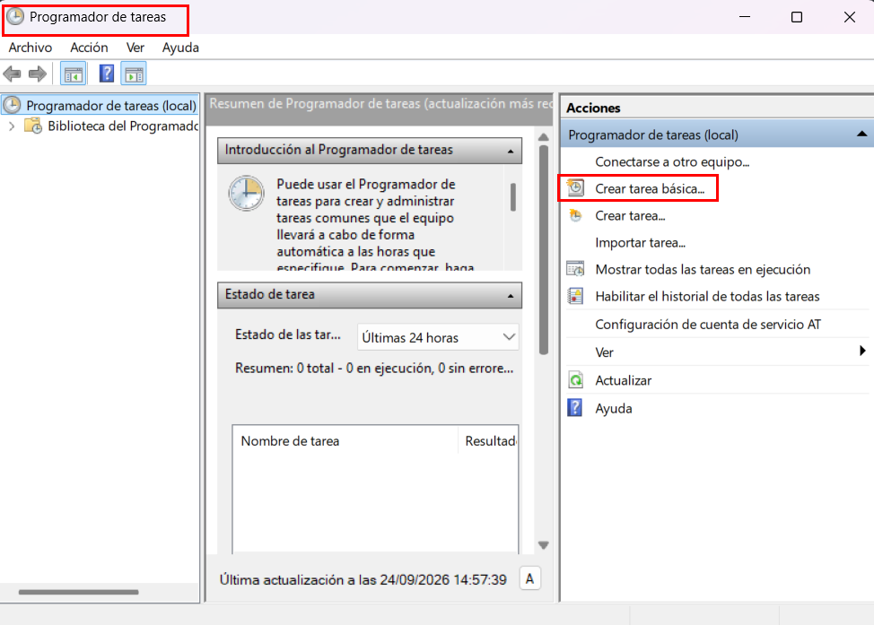

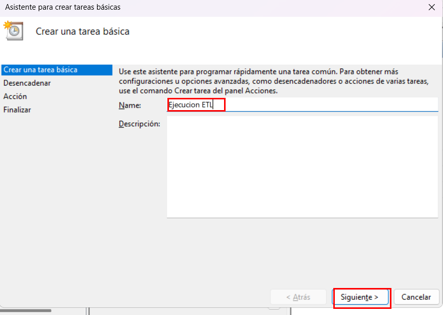

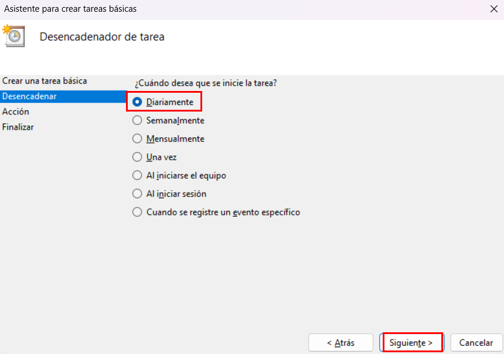

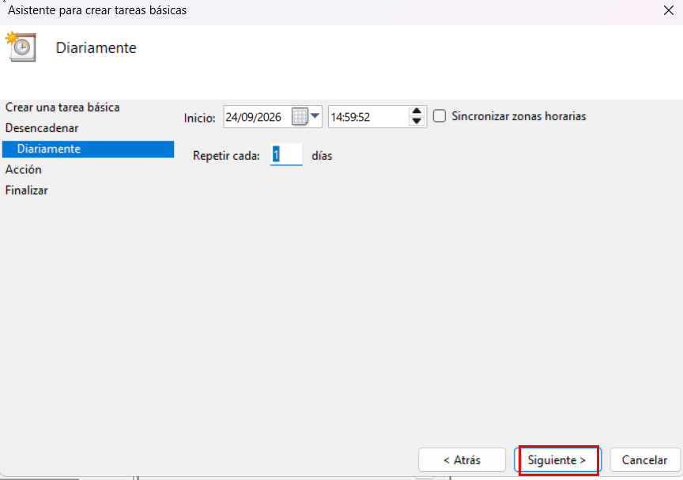

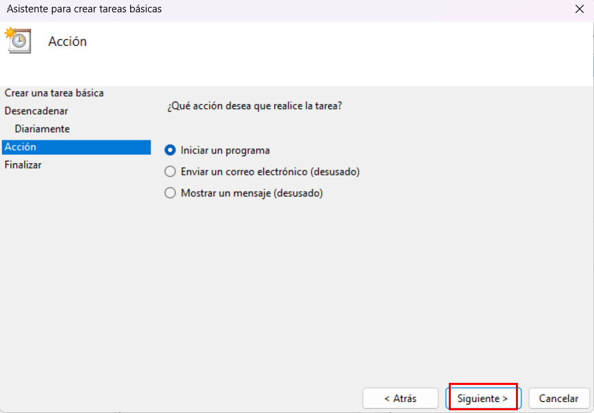

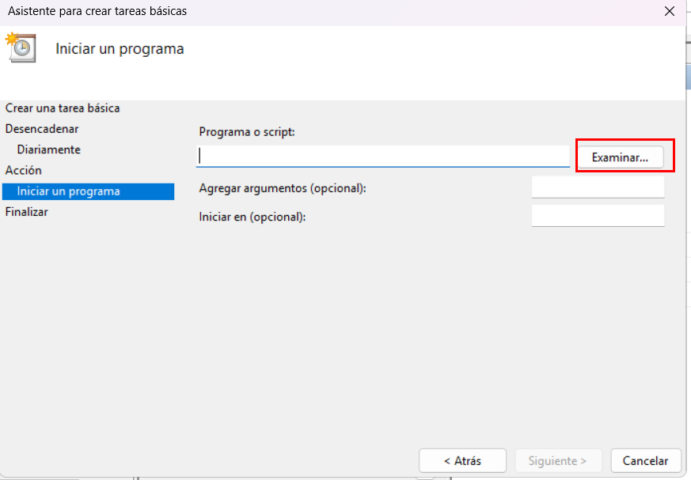

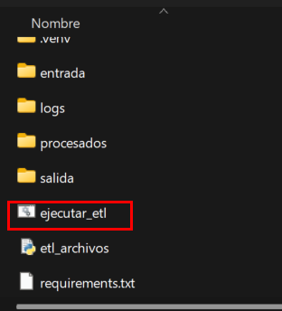

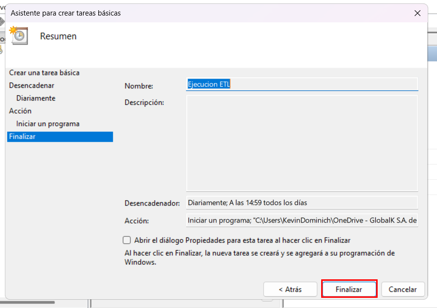

Hacer doble clic en `Biblioteca del Programador de Tareas`.

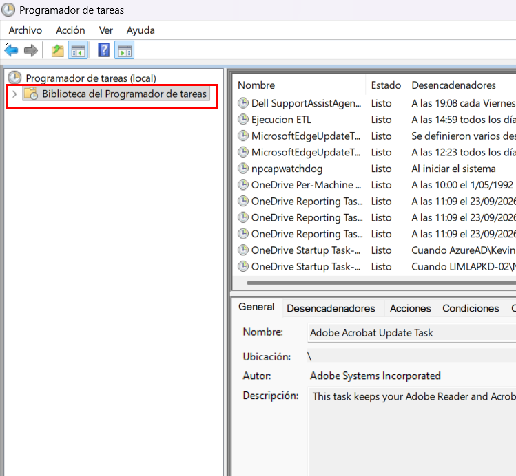

Paso 20. Use **Ejecutar** en el Programador de tareas y compruebe el resultado en `logs/etl_archivos.log`.

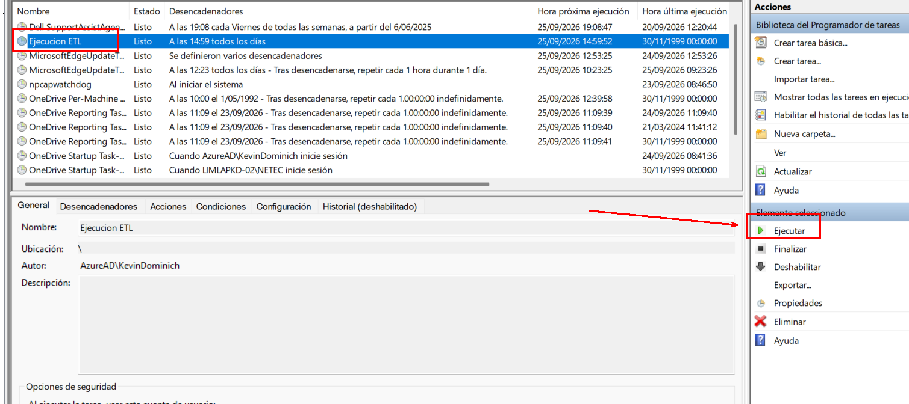

### Resultado esperado

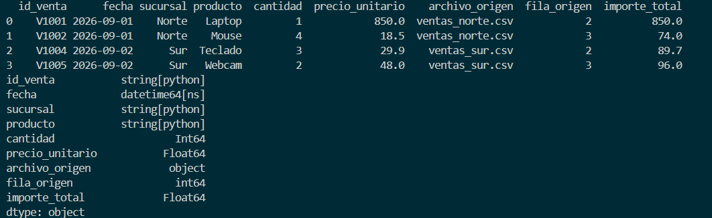
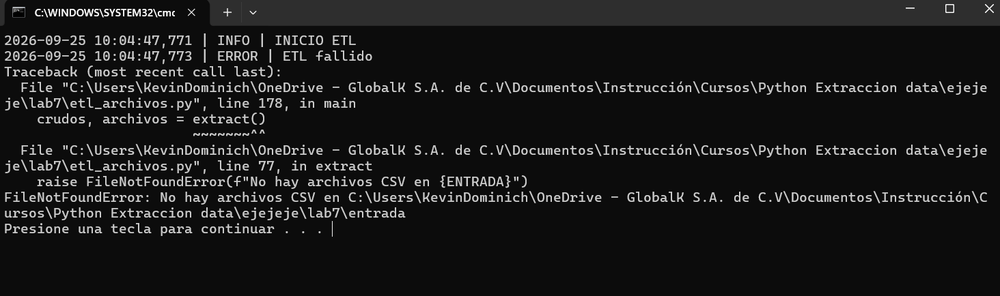
