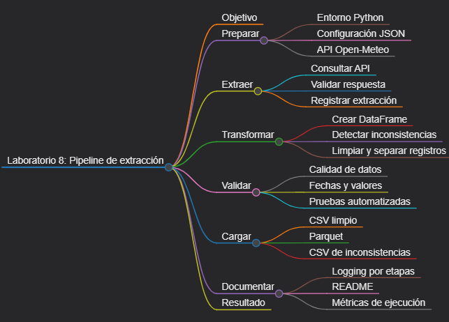
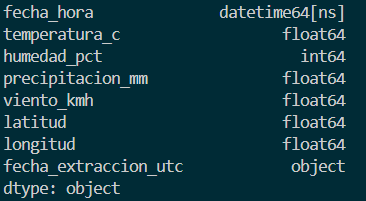

# Laboratorio 8: Desarrollo de un pipeline completo de extracción

## Objetivo de la práctica:

Desarrollar un pipeline completo que extraiga datos meteorológicos de una API pública, valide la respuesta, convierta los datos a un DataFrame, detecte y separe inconsistencias, limpie y transforme los registros, genere CSV y Parquet, registre eventos con logging, incluya pruebas automatizadas y documente su operación.

## Objetivo Visual:

## Duración aproximada:

- 75 minutos

## Instrucciones



### Tarea 1. **Preparación del entorno y estructura**

Paso 1. En Windows, abra **Visual Studio Code**, cree `laboratorio_8` dentro de la carpeta del capítulo y ábralo con **File -> Open Folder**.

La práctica utiliza la [API de pronóstico de Open-Meteo](https://open-meteo.com/en/docs), que permite consultas sin API key.

Paso 3. Prepare el proyecto desde PowerShell:

```powershell
py -3 -m venv .venv
.\.venv\Scripts\Activate.ps1
python -m pip install --upgrade pip
New-Item -ItemType Directory -Force -Path src, tests, salida, logs
New-Item -ItemType File -Force -Path src\__init__.py, src\pipeline.py, tests\test_pipeline.py, config.json, requirements.txt, README.md
```

Si PowerShell bloquea la activación, ejecute `Set-ExecutionPolicy -Scope Process -ExecutionPolicy Bypass` y vuelva a activar el entorno.

Paso 4. Seleccione `.venv\Scripts\python.exe` con **Python: Select Interpreter** y agregue a `requirements.txt`:

```text
pandas>=2.2,<3
pyarrow>=15,<25
pytest>=8,<10
requests>=2.31,<3
```

Paso 5. Instale las dependencias:

```powershell
python -m pip install -r requirements.txt
```

### Tarea 2. **Documento de configuración**

Paso 6. Coloque los siguientes datos en el archivo `config.json`. Dos datos indispensables son `latitud` y `longitud`; el siguiente ejemplo utiliza Madrid, España:

```json
{
  "latitud": 40.4168,
  "longitud": -3.7038,
  "zona_horaria": "Europe/Madrid",
  "dias_pronostico": 3
}
```

Si se elige otra ciudad, use latitud entre `-90` y `90`, longitud entre `-180` y `180`, una zona horaria válida de la base IANA y entre uno y siete días. No se requieren otros documentos de entrada: los registros provienen de la API.

### Tarea 3. **Configuración, logging y carga de parámetros**

Paso 7. Abra `src/pipeline.py` y agregue las importaciones, rutas y logger. El archivo rotará al alcanzar 2 MB.

```python
import json
import logging
from datetime import datetime, timezone
from logging.handlers import RotatingFileHandler
from pathlib import Path

import pandas as pd
import requests


BASE_DIR = Path(__file__).resolve().parents[1]
CONFIG = BASE_DIR / "config.json"
SALIDA = BASE_DIR / "salida"
LOGS = BASE_DIR / "logs"
API_URL = "https://api.open-meteo.com/v1/forecast"


def configurar_logger() -> logging.Logger:
    LOGS.mkdir(parents=True, exist_ok=True)
    logger = logging.getLogger("pipeline_meteorologico")
    logger.setLevel(logging.DEBUG)
    logger.handlers.clear()
    formato = logging.Formatter(
        "%(asctime)s | %(name)s | %(levelname)s | %(message)s"
    )

    consola = logging.StreamHandler()
    consola.setLevel(logging.INFO)
    consola.setFormatter(formato)
    archivo = RotatingFileHandler(
        LOGS / "pipeline.log",
        maxBytes=2_000_000,
        backupCount=3,
        encoding="utf-8",
    )
    archivo.setLevel(logging.DEBUG)
    archivo.setFormatter(formato)
    logger.addHandler(consola)
    logger.addHandler(archivo)
    return logger


logger = configurar_logger()
```

Paso 8. Agregue la carga y validación de configuración:

```python
def cargar_configuracion(ruta: Path = CONFIG) -> dict:
    with ruta.open("r", encoding="utf-8") as archivo:
        config = json.load(archivo)

    requeridas = {"latitud", "longitud", "zona_horaria", "dias_pronostico"}
    faltantes = requeridas - set(config)
    if faltantes:
        raise ValueError(f"Faltan claves de configuración: {sorted(faltantes)}")

    latitud = float(config["latitud"])
    longitud = float(config["longitud"])
    dias = int(config["dias_pronostico"])
    if not -90 <= latitud <= 90:
        raise ValueError("latitud debe estar entre -90 y 90.")
    if not -180 <= longitud <= 180:
        raise ValueError("longitud debe estar entre -180 y 180.")
    if not 1 <= dias <= 7:
        raise ValueError("dias_pronostico debe estar entre 1 y 7.")

    config.update(
        {"latitud": latitud, "longitud": longitud, "dias_pronostico": dias}
    )
    return config
```

### Tarea 4. **Extracción y validación de la respuesta**

Paso 9. Agregue `extract()`. La función solicita cuatro series horarias y comprueba que tengan la misma longitud antes de continuar.

```python
def extract(config: dict) -> dict:
    parametros = {
        "latitude": config["latitud"],
        "longitude": config["longitud"],
        "hourly": (
            "temperature_2m,relative_humidity_2m,"
            "precipitation,wind_speed_10m"
        ),
        "timezone": config["zona_horaria"],
        "forecast_days": config["dias_pronostico"],
    }
    logger.info("ETAPA 1/4 | Extracción iniciada")
    try:
        respuesta = requests.get(API_URL, params=parametros, timeout=(5, 20))
        respuesta.raise_for_status()
    except requests.Timeout as error:
        raise RuntimeError("La API superó el tiempo de espera.") from error
    except requests.RequestException as error:
        raise RuntimeError(f"Error al consultar la API: {error}") from error

    try:
        datos = respuesta.json()
    except requests.exceptions.JSONDecodeError as error:
        raise ValueError("La API no devolvió JSON válido.") from error

    hourly = datos.get("hourly")
    campos = [
        "time",
        "temperature_2m",
        "relative_humidity_2m",
        "precipitation",
        "wind_speed_10m",
    ]
    if not isinstance(hourly, dict) or not all(
        isinstance(hourly.get(campo), list) for campo in campos
    ):
        raise ValueError("La respuesta no contiene las series horarias esperadas.")
    longitudes = {len(hourly[campo]) for campo in campos}
    if len(longitudes) != 1 or longitudes == {0}:
        raise ValueError("Las series horarias están vacías o desalineadas.")

    logger.info("ETAPA 1/4 | Registros recibidos=%d", len(hourly["time"]))
    return datos
```

### Tarea 5. **Transformación y detección de inconsistencias**

Paso 10. Agregue `transform()`. Las reglas detectan fechas inválidas, temperaturas fuera de un rango físico razonable, humedad fuera de `0-100`, precipitación negativa y viento negativo.

```python
def transform(datos: dict) -> tuple[pd.DataFrame, pd.DataFrame]:
    logger.info("ETAPA 2/4 | Transformación iniciada")
    hourly = datos["hourly"]
    df = pd.DataFrame(
        {
            "fecha_hora": pd.to_datetime(hourly["time"], errors="coerce"),
            "temperatura_c": pd.to_numeric(
                hourly["temperature_2m"], errors="coerce"
            ),
            "humedad_pct": pd.to_numeric(
                hourly["relative_humidity_2m"], errors="coerce"
            ),
            "precipitacion_mm": pd.to_numeric(
                hourly["precipitation"], errors="coerce"
            ),
            "viento_kmh": pd.to_numeric(
                hourly["wind_speed_10m"], errors="coerce"
            ),
        }
    )
    df["latitud"] = datos.get("latitude")
    df["longitud"] = datos.get("longitude")
    df["fecha_extraccion_utc"] = datetime.now(timezone.utc).isoformat()

    motivos = pd.Series("", index=df.index, dtype="string")
    reglas = [
        (df["fecha_hora"].isna(), "fecha inválida; "),
        (~df["temperatura_c"].between(-90, 60), "temperatura fuera de rango; "),
        (~df["humedad_pct"].between(0, 100), "humedad fuera de rango; "),
        (df["precipitacion_mm"].lt(0), "precipitación negativa; "),
        (df["viento_kmh"].lt(0), "viento negativo; "),
        (
            df[
                [
                    "temperatura_c",
                    "humedad_pct",
                    "precipitacion_mm",
                    "viento_kmh",
                ]
            ].isna().any(axis=1),
            "valor numérico ausente; ",
        ),
        (df["fecha_hora"].duplicated(keep="first"), "fecha duplicada; "),
    ]
    for condicion, texto in reglas:
        motivos = motivos.mask(condicion.fillna(True), motivos + texto)

    df["motivo_rechazo"] = motivos.str.rstrip("; ")
    validos = df[df["motivo_rechazo"].eq("")].drop(columns="motivo_rechazo")
    rechazados = df[df["motivo_rechazo"].ne("")]
    validos = validos.sort_values("fecha_hora").reset_index(drop=True)

    logger.info(
        "ETAPA 2/4 | Válidos=%d | Rechazados=%d",
        len(validos),
        len(rechazados),
    )
    return validos, rechazados.reset_index(drop=True)
```

Paso 11. Agregue una validación final con estrategia *fail fast*:

```python
def validate(df: pd.DataFrame) -> None:
    logger.info("ETAPA 3/4 | Validación iniciada")
    if df.empty:
        raise ValueError("No existen registros válidos para cargar.")
    requeridas = {
        "fecha_hora",
        "temperatura_c",
        "humedad_pct",
        "precipitacion_mm",
        "viento_kmh",
        "latitud",
        "longitud",
        "fecha_extraccion_utc",
    }
    faltantes = requeridas - set(df.columns)
    if faltantes:
        raise ValueError(f"Faltan columnas de salida: {sorted(faltantes)}")
    if df[list(requeridas)].isna().any().any():
        raise ValueError("La salida contiene valores nulos.")
    if df["fecha_hora"].duplicated().any():
        raise ValueError("La salida contiene fechas duplicadas.")
    logger.info("ETAPA 3/4 | Validación correcta")
```

### Tarea 6. **Carga, orquestación y métricas**

Paso 12. Agregue `load()` para producir CSV, Parquet y, cuando corresponda, un CSV de inconsistencias:

```python
def load(validos: pd.DataFrame, rechazados: pd.DataFrame) -> None:
    logger.info("ETAPA 4/4 | Carga iniciada")
    SALIDA.mkdir(parents=True, exist_ok=True)
    validos.to_csv(
        SALIDA / "clima_limpio.csv",
        index=False,
        encoding="utf-8-sig",
        date_format="%Y-%m-%dT%H:%M:%S",
    )
    validos.to_parquet(
        SALIDA / "clima_limpio.parquet",
        index=False,
        engine="pyarrow",
    )
    rechazados.to_csv(
        SALIDA / "clima_inconsistente.csv",
        index=False,
        encoding="utf-8-sig",
        date_format="%Y-%m-%dT%H:%M:%S",
    )
    logger.info("ETAPA 4/4 | Archivos generados en %s", SALIDA)
```

Paso 13. Agregue el orquestador y el punto de entrada:

```python
def run() -> int:
    inicio = datetime.now(timezone.utc)
    logger.info("INICIO PIPELINE")
    try:
        config = cargar_configuracion()
        datos = extract(config)
        validos, rechazados = transform(datos)
        validate(validos)
        load(validos, rechazados)
    except Exception:
        logger.exception("PIPELINE FALLIDO")
        return 1

    duracion = (datetime.now(timezone.utc) - inicio).total_seconds()
    logger.info(
        "FIN PIPELINE | duración=%.3fs | procesados=%d | errores=%d",
        duracion,
        len(validos),
        len(rechazados),
    )
    return 0


if __name__ == "__main__":
    raise SystemExit(run())
```

### Tarea 7. **Pruebas automatizadas**

Paso 14. Abra `tests/test_pipeline.py`. Las pruebas usan datos locales y no llaman a Internet, por lo que son rápidas y repetibles.

```python
import pandas as pd
import pytest

from src.pipeline import transform, validate


def respuesta_sintetica() -> dict:
    return {
        "latitude": -12.04,
        "longitude": -77.03,
        "hourly": {
            "time": ["2026-09-01T00:00", "2026-09-01T01:00"],
            "temperature_2m": [18.5, 19.0],
            "relative_humidity_2m": [80, 78],
            "precipitation": [0.0, 0.2],
            "wind_speed_10m": [8.0, 9.5],
        },
    }


def test_transform_conserva_dos_registros_validos():
    validos, rechazados = transform(respuesta_sintetica())
    assert len(validos) == 2
    assert rechazados.empty
    assert pd.api.types.is_datetime64_any_dtype(validos["fecha_hora"])


def test_transform_detecta_registro_inconsistente():
    datos = respuesta_sintetica()
    datos["hourly"]["temperature_2m"][1] = 200
    datos["hourly"]["relative_humidity_2m"][1] = 110
    validos, rechazados = transform(datos)
    assert len(validos) == 1
    assert len(rechazados) == 1
    assert "fuera de rango" in rechazados.loc[0, "motivo_rechazo"]


def test_validate_rechaza_dataframe_vacio():
    with pytest.raises(ValueError, match="No existen registros"):
        validate(pd.DataFrame())
```

Paso 15. Ejecute la suite:

```powershell
python -m pytest -qsegunda
```

Las tres pruebas deben finalizar correctamente. La segunda demuestra que la detección funciona incluso si la API real entrega datos limpios.

### Tarea 8. **Documentación, ejecución y validaciones finales**

Paso 16. Use el `README.md` ubicado dentro de `laboratorio_8` como documentación básica del proyecto y agregue:

````markdown
# Pipeline meteorológico

Extrae un pronóstico horario desde Open-Meteo, aplica reglas de calidad y genera CSV y Parquet.

## Requisitos

- Python 3.11 o posterior.
- Acceso HTTPS a `api.open-meteo.com`.
- Configuración en `config.json`.

## Ejecución

```powershell
python -m src.pipeline
python -m pytest -q
```

## Salidas

- `salida/clima_limpio.csv`: datos tabulares legibles.
- `salida/clima_limpio.parquet`: datos con esquema y compresión.
- `salida/clima_inconsistente.csv`: registros rechazados y motivo.
- `logs/pipeline.log`: auditoría de la ejecución.
````

Paso 17. Ejecute el pipeline completo:

```powershell
python -m src.pipeline
```

Paso 18. Compare los resultados CSV y Parquet:

```powershell
python -c "import pandas as pd; a=pd.read_csv('salida/clima_limpio.csv'); b=pd.read_parquet('salida/clima_limpio.parquet'); print(a.shape, b.shape); print(b.dtypes)"
```

Paso 19. Revise `logs/pipeline.log` y confirme que contiene inicio, fin, duración, registros procesados, errores y mensajes por cada etapa.

### Resultado esperado


